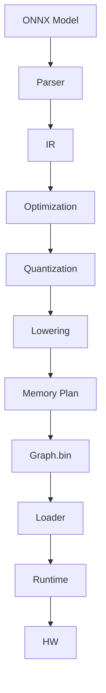

# AzureEngine Graph Runtime & Compiler Design Document
## Version 1.0 — Formal Technical Specification
## Author: Rain + ChatGPT
## Date: 2025-xx-xx

# Table of Contents
1. Overview  
2. End-to-End Architecture  
3. Graph.bin Specification  
4. Runtime Architecture  
5. Compiler Architecture  
6. Operator Mapping Strategy  
7. Quantization Architecture  
8. Memory Planning  
9. Execution Flow (Runtime)  
10. Multi-Device Scheduling  
11. Accuracy & Functional Verification Framework  
12. Stress Test & Regression Test  
13. Tools & QA Scripts  
14. Future Extensions  
15. Appendix  

---

# 1. Overview
This document defines the complete software and hardware execution pipeline used by AzureEngine Graph Runtime...

# 2. End-to-End Architecture


# 3. Graph.bin Specification

sequenceDiagram
    participant Main as main()
    participant T0 as device_thread(0)
    participant T1 as device_thread(1)
    participant T2 as device_thread(2)
    participant T3 as device_thread(3)
    participant G0 as _graphs[0]
    participant G1 as _graphs[1]
    participant G2 as _graphs[2]
    participant G3 as _graphs[3]

    Main->>Main: 创建 4 个 std::thread\n(dev_id = 0..3)
    Main->>T0: start
    Main->>T1: start
    Main->>T2: start
    Main->>T3: start

    T0->>G0: LoadModel(0)\n(内部 new RppFwGraphs(...))
    T0->>G0: inference(0)\n(填 input, exec_rpp_fw, save output)
    T0->>T0: infer_count++\n并周期性重载 model

    T1->>G1: LoadModel(1) ...
    T2->>G2: LoadModel(2) ...
    T3->>G3: LoadModel(3) ...

    Note over T0,T3: 每个 dev_id 都有各自的\nRppFwGraphs* _graphs[dev_id]\n和自己的 input binding/output 名称

# 4. Runtime Architecture
(Insert full content…)

# 5. Compiler Architecture
(Insert full content…)

# 6. Operator Mapping Strategy
(Insert full content…)

# 7. Quantization Architecture
(Insert full content…)

# 8. Memory Planning
(Insert full content…)

# 9. Execution Flow
(Insert full content…)

# 10. Multi-Device Scheduling
(Insert full content…)

# 11. Accuracy Verification
(Insert full content…)

# 12. Stress Test
(Insert full content…)

# 13. QA Tools
(Insert full content…)

# 14. Future Extensions
(Insert full content…)

# 15. Appendix
(Insert full content…)
```

# END
