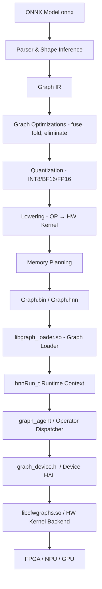
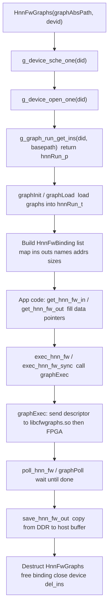
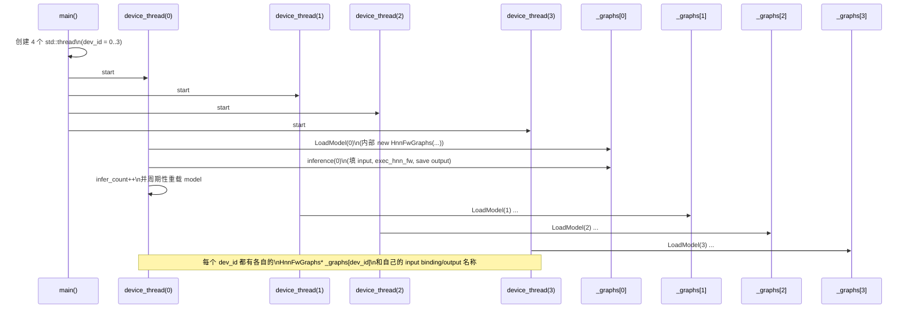
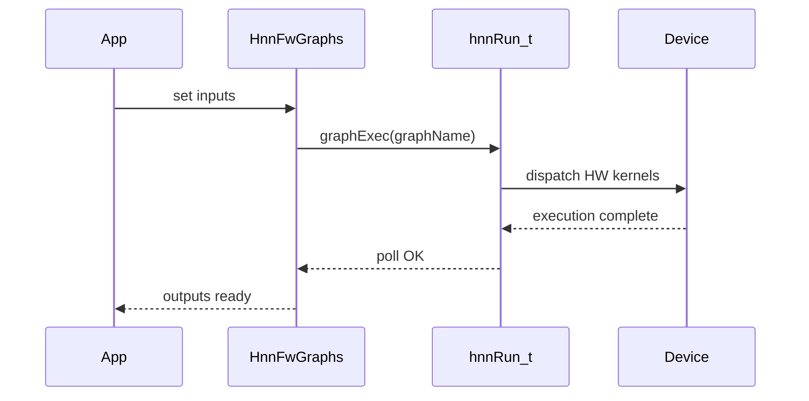

# HNNBrain Graph Runtime & Compiler Design Document  
**Version 1.0 — Technical Specification**  
**Author:** Rain + ChatGPT  
**Date:** 2025-09-01  
**Abbr:** hnn - hnet neutral network

---

# Table of Contents
- [1. Overview](#1-overview)
- [2. End-to-End Architecture](#2-end-to-end-architecture)
- [3. Graphbin-hnn-file-specification](#3-graphbin-hnn-file-specification)
- [4. Runtime Architecture](#4-runtime-architecture)
- [5. Compiler Architecture](#5-compiler-architecture)
- [6. Operator Mapping Strategy](#6-operator-mapping-strategy)
- [7. Quantization Architecture](#7-quantization-architecture)
- [8. Memory Planning](#8-memory-planning)
- [9. Execution Flow (Runtime)](#9-execution-flow-runtime)
- [10. Multi-Device Scheduling](#10-multi-device-scheduling)
- [11. Accuracy & Functional Verification Framework](#11-accuracy--functional-verification-framework)
- [12. Stress Test & Regression Test](#12-stress-test--regression-test)
- [13. Tools & QA Scripts](#13-tools--qa-scripts)
- [14. Future Extensions](#14-future-extensions)
- [15. Appendix](#15-appendix)

---

# 1. Overview
This document defines the complete execution pipeline used by HNNBrain Graph Runtime:

- ONNX → Graph Compiler  
- Graph Compiler → Graph.bin (.hnn)  
- Graph.bin → Runtime Loader  
- Runtime → FPGA/NPU/GPGPU Execution  
- Validation and QA  
- Auto-testing and regression framework  

This design follows industry ML compiler best practices (TensorRT, Vitis-AI, SNPE, CUDA/TensorRT).

---

# 2. End-to-End Architecture




---

# 3. Graph.bin Specification

Graph.bin contains all data needed to execute a neural network model.

## 3.1 Top-level File Layout

```
[Header]
[Graph Sections...]
[Weights Blob]
```

## 3.2 Header Structure

| Field | Description |
|-------|-------------|
| MAGIC | "HNNG" |
| version | compiler version |
| graph_count | number of graphs |
| reserved | alignment padding |

---

## 3.3 Per-Graph Section

```
[GraphMetadata]
[Input IO Descriptors]
[Output IO Descriptors]
[Kernel Entry List]
[Weights / Constants]
```

### GraphMetadata (maps to hnnGraph_t)

- graph_id  
- graph_name  
- base DDR address  
- queue ID  
- device index  

---

### IO Descriptors (map to hnnIO_t)

| Field | Description |
|------|-------------|
| tensor_name | string |
| tensor_dtype | FP32 / FP16 / BF16 / INT8 |
| tensor_shape | [N,C,H,W] |
| tensor_size | bytes |
| tensor_daddr | DDR addr |
| tensor_saddr | optional SRAM addr |

---

### Kernel Entry List (graph_entry)

| Field | Description |
|-------|-------------|
| kernel_id | HW kernel type |
| desc_type | descriptor type (sync/event/APB) |
| input_list | input DDR addrs |
| output_list | output DDR addrs |
| dependency_events | dependency info |

---

# 4. Runtime Architecture

Runtime components:

```
hnnRun_t (runtime context)
  |
  +-- graphInit / graphLoad
  +-- graphExec
  +-- graphPoll
  +-- DMA APIs (MapDma, PhyDma, UnmDma)
  +-- shm alloc/free
  +-- list of all graphs (graph_head)
```

## 4.1 hnnRun_t Structure

```c
typedef struct _hnnRun {
    NRINT did;
    PATH_A graphPath;

    PDMA graphMapDma;
    PDMA graphUnmDma;
    PDMA graphPhyDma;

    INIT graphInit;
    EXEC graphExec;
    POLL graphPoll;

    hnnList_t graph_head;
} hnnRun_t;
```

## 4.2 hnnGraph_t Structure

A single model representation, including IO descriptors and kernel entries.

## 4.3 HnnFwGraphs (C++ Wrapper)

High-level API for application:

- load graph  
- allocate input/output buffers  
- execute  
- retrieve outputs  
- manage device  

## 4.4 HnnRT Sequence Diagram



---

## 4.5 HnnRT MultiDevcies Sequence Diaggram



---

# 5. Compiler Architecture

## 5.1 Frontend

- Parse ONNX  
- Shape inference  
- Normalize inputs  

## 5.2 IR (Intermediate Representation)

Graph IR nodes contain:

- op type  
- input/output tensors  
- attributes  
- topological order  

## 5.3 Optimizations

- Conv+BN+ReLU fusion  
- Constant folding  
- Dead node elimination  
- CSE  
- Layout transform (NCHW ↔ NHWC)  

## 5.4 Quantization

- Calibration set  
- Activation statistics  
- Scale/zero-point computation  
- Model rewriting (INT8/BF16)  

## 5.5 Lowering

- Map IR OP → HW Kernel  
- Generate kernel descriptors  
- Memory allocation  
- Graph.bin serialization  

---

# 6. Operator Mapping Strategy

| ONNX OP | IR OP | HW Kernel |
|--------|--------|-----------|
| Conv | conv2d | HW_KERNEL_CONV2D |
| MatMul | gemm | HW_KERNEL_GEMM |
| Add | eltadd | HW_KERNEL_ELTWISE |
| Relu | relu | HW_KERNEL_ACT |
| Resize | resize | HW_KERNEL_RESIZE |

Functional equivalence and accuracy validation required for each OP.

---

# 7. Quantization Architecture

## 7.1 Calibration Pipeline

```
FP32 → Activation Stats → Scale/ZP → INT8 Graph
```

## 7.2 Modes

- symmetric / asymmetric  
- per-tensor / per-channel  
- weight-only quantization  

---

# 8. Memory Planning

Memory planner assigns:

- input/output buffers  
- intermediate tensors  
- constant weights  
- working buffers  

Goals:

- minimize memory  
- ensure alignment  
- maximize reuse  

---

# 9. Execution Flow (Runtime)

## Sequence Diagram



---

# 10. Multi-Device Scheduling

- Each device ID has its own `hnnRun_t`  
- Per-device input/output buffers  
- Parallel execution through multithreading  
- No cross-device memory sharing  

---

# 11. Accuracy & Functional Verification Framework

## 11.1 OP-Level Verification

```
onnxruntime(OP) vs graph.bin(OP)
```

Metrics:

- max diff  
- mean diff  
- tolerance threshold  

## 11.2 Graph-Level Validation

- ONNX FP32 vs GraphBin  
- Compare accuracy, mAP, IoU, etc.  

## 11.3 Dataset-Level Testing

- Accuracy drop < 1%  
- mAP drop < 0.5%  

---

# 12. Stress Test & Regression Test

## 12.1 Random Stress Test

Run 1000 randomized inputs:

- test stability  
- detect NaN/Inf  
- detect kernel crash  

## 12.2 Regression Test

Triggered when:

- compiler updated  
- kernel updated  
- runtime modified  

Automatically run full QA suite.

---

# 13. Tools & QA Scripts

## 13.1 verify_model.py

- ONNX FP32  
- runtime graph.bin  
- compare outputs  

## 13.2 dump_graph_meta

- C++ helper to extract hnnGraph_t  
- Python viewer for graph structure  

## 13.3 stress_random.py

- 1000-case validation  

---

# 14. Future Extensions

- Dynamic shapes  
- Mixed precision  
- Multi-graph scheduling  
- Graph partitioning  
- Performance modeling  

---

# 15. Appendix

## Key Runtime Files

| File | Purpose |
|------|---------|
| graph_run.h | Runtime context / DMA / exec / poll |
| graph_device.h | Device scheduler + driver |
| graph_file.h | Serialization helper |
| graph.hpp / graph.cpp | C++ abstraction |
| H24standalonehnntest.cpp | Multi-device stress test |

---

