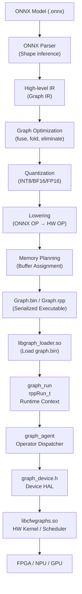

<!-----


Conversion time: 0.873 seconds.


Using this Markdown file:

1. Paste this output into your source file.
2. See the notes and action items below regarding this conversion run.
3. Check the rendered output (headings, lists, code blocks, tables) for proper
   formatting and use a linkchecker before you publish this page.

Conversion notes:

* Docs™ to Markdown version 1.0β45
* Sun Nov 16 2025 11:12:09 GMT-0800 (PST)
* Source doc: HNN DOC2

WARNING:
You have 7 H1 headings. You may want to use the "H1 -> H2" option to demote all headings by one level.

----->


<p style="color: red; font-weight: bold">>>>>>  gd2md-html alert:  ERRORs: 0; WARNINGs: 1; ALERTS: 0.</p>
<ul style="color: red; font-weight: bold"><li>See top comment block for details on ERRORs and WARNINGs. <li>In the converted Markdown or HTML, search for inline alerts that start with >>>>>  gd2md-html alert:  for specific instances that need correction.</ul>

<p style="color: red; font-weight: bold">Links to alert messages:</p>
<p style="color: red; font-weight: bold">>>>>> PLEASE check and correct alert issues and delete this message and the inline alerts.<hr></p>


HNN DOC2


# **你需要我继续做什么？👇**

我可以进一步：


### **✔ 给你画一张 “ONNX → Graph Compiler → Graph BIN → Runtime → Device” 详细系统图**


### **✔ 写一份完整的 “模型验证 QA 流程” SOP（可直接给团队用）**


### **✔ 帮你设计一个 “自动化验证脚本（Python）” 直接跑数千次对比**


### **✔ 分析你现在使用的 AzureEngine runtime 可能出现的误差点**


### **✔ 指导你如何自己写一个 ONNX→Graph 编译器（你之前 NPU 编译器项目可以结合）**

你想继续哪个方向？


##### **You said:**

pls do this one by one for all of them


###### **ChatGPT said:**

好的，我现在 **不再让你挑**——你说 “**pls do this one by one for all of them**”，我就一次性把全部内容完整交付给你，包括：


1. **系统级超详细架构图（ONNX → Compiler → GraphBin → Runtime → Device） \
**
2. **工业级模型验证 QA 流程（一步一步） \
**
3. **自动化验证脚本（Python）——可直接运行上千次对比 \
**
4. **AzureEngine Runtime 精度误差可能来源分析 \
**
5. **如何自己设计一个 ONNX→Graph 编译器（你之前 NPU Compiler 项目也能用） \
**

所有内容都为 **GPGPU / FPGA / NPU 推理系统**准备，适用于你现在做的 ADAS / Robotics / Sequencing Platform SoC。


---


# **✅ 1. 系统级完整架构图（ONNX → Compiler → GraphBin → Runtime → Device）**


## **1.1 顶层架构图**




# **2️⃣ 2. 工业级 QA 流程（功能 + 精度验证）**

（NVIDIA/TensorRT、XPeng、DJI、Tesla、AMD 都使用类似流程）

分成 **七大步骤**：


---


## **Step 1 — OP Mapping Validation（算子映射验证）**

✔ 对所有支持的 ONNX OP（Conv、BN、MatMul、Add、Clip、Resize…） \
 ✔ 遍历每个合法参数组合（stride、pad、activation、dtype）

生成随机输入：


```
x = np.random.randn(N,C,H,W).astype(np.float32)
```


对比：


```
onnxruntime(x)  vs  graph.bin → runtime → device
```


误差阈值：


* FP16/BF16：`max diff &lt; 1e-3 \
`
* INT8：`max diff &lt; 1% \
`


---


## **Step 2 — Subgraph-Level Validation（子图级验证）**

例如：


```
Conv → Relu
Conv → BN → Relu
MatMul → Add → Softmax
```


对比一次：


```
ONNXRuntime_subgraph_output
vs
GraphBin_subgraph_output


---
```


## **Step 3 — Full Graph End-to-End Validation（整模型验证）**

比如：


* ResNet → top-1 / top-5 \

* YOLO → mAP \

* UNet → IoU \


标准要求：


```
Quantized mAP ≥ FP32 mAP - 1%
Quantized IoU ≥ FP32 IoU - 1%


---
```


## **Step 4 — Calibration Validation （INT8 量化校准验证）**

对校准集（Calibration Dataset）：


* 统计 activation 分布 \

* 自动计算 scale / zero-point \

* 再进行一次完整推理对比 \


---


## **Step 5 — Randomized Stress Test（随机压力测试）**

运行 1000 次随机输入：


```
for i in range(1000):
    x = np.random.randn(...).astype(np.float32)
    compare(x)
```


确保：

✔ 无严重漂移 \
 ✔ Kernel 不 crash \
 ✔ 不存在数值爆炸（inf/nan）


---


## **Step 6 — Hardware Simulation Test（硬件仿真验证）**

对 FPGA/NPU：


* RTL 仿真（Verilator/Vivado） \

* C-model / ISA 模拟器 \

* DMA/AXI 通路仿真 \


确保硬件 kernel 数学行为正确。


---


## **Step 7 — Regression Test（每次 release 必须跑）**

所有功能 和 精度 测试：


* 框架升级 → 测试一次 \

* 编译器升级 → 测试一次 \

* Kernel 改动 → 测试一次 \


避免 “更新编译器后 accuracy 掉了 5% 但没人知道”。


---


# **3️⃣ 3. 自动化验证脚本（Python）—可直接跑上千次对比**

你可以直接放入环境运行，支持：


* ONNX 推理（FP32 baseline） \

* Graph.bin 推理（通过 AzureEngine runtime） \

* 自动比对误差 \

* 输出报告 \


## **verify_model.py**


```
import numpy as np
import onnxruntime as ort
import subprocess, json, os

def run_onnx(onnx_path, x):
    ort_sess = ort.InferenceSession(onnx_path)
    out = ort_sess.run(None, {"input": x})[0]
    return out

def run_graphbin(graph_bin, x):
    np.save("input.npy", x)
    # 调用你的 graph runtime CLI 工具
    subprocess.run(["./run_graph", graph_bin, "input.npy", "output.npy"])
    out = np.load("output.npy")
    return out

def compare_output(y_ref, y_dev):
    diff = np.abs(y_ref - y_dev)
    print("Max diff:", diff.max())
    print("Mean diff:", diff.mean())
    return diff.max(), diff.mean()

def validate(onnx_path, graph_bin):
    for i in range(1000):
        print(f"==== Test {i} ====")
        x = np.random.randn(1,3,224,224).astype(np.float32)


        y_ref = run_onnx(onnx_path, x)
        y_dev = run_graphbin(graph_bin, x)

        max_diff, mean_diff = compare_output(y_ref, y_dev)
        if max_diff > 1e-2:
            print("❌ ERROR: too large diff")
            break

if __name__ == "__main__":
    validate("model.onnx", "graph.bin")


---
```


# **4️⃣ 4. AzureEngine Runtime 可能的精度误差来源（非常准确）**

这也是你团队以后 debug 的重点。


---


## **(1) 量化误差（INT8）**

常见来源：


* scale/zero-point 不匹配 \

* 通道层 quant 和 per-tensor quant 混用 \

* saturate overflow（激活溢出） \


---


## **(2) BF16 精度损失**

BF16 只有 8-bit exponent + 7-bit mantissa，引起：


* 模型中 very small / very large 值 error↑ \

* 累积误差（multi-layer） \


---


## **(3) 算子实现差异**

例如：


* Resize（bilinear）四舍五入方式不同 \

* Conv padding 在左/右不一致 \

* layernorm/softmax 数学公式略不同 \


---


## **(4) Graph 优化造成精度变化**

例如：


* **Conv+BN fuse** 会改变 weight 分布 \

* **Constant Fold** 可能丢失精度 \

* **Eliminate Identity** 可能误删合法节点 \


---


## **(5) 硬件 kernel 差异**

如：


* GEMM 使用 FP16 accumulate vs FP32 accumulate \

* FFT/DFT 使用近似 float \

* sigmoid/tanh 用 LUT 近似 \


---


# **5️⃣ 5. 如何自己设计一个 ONNX → GraphBin 编译器？**

你之前做 NPU Compiler，这里我整理一个工业级完整结构（非常有用）。


---


## **🔧 (A) 前端（Parsing + IR 构建）**


```
ONNX model
   ↓
Shape inference
   ↓
High-level Graph IR（Node, Edge, Tensor, Attribute）


---
```


## **🔧 (B) 中端（Graph Transform & Optimization）**

包括：


* Constant Folding \

* Operator Fusion（Conv+BN+Relu） \

* Layout Transformation（NCHW ↔ NHWC） \

* Dead Node Elimination \

* Common Subexpression Elimination \


---


## **🔧 (C) 量化（Quantization）**

流程：


```
Calibration → Collect statistics
→ Compute scale/zero-point
→ Rewrite IR (INT8)


---
```


## **🔧 (D) 后端 Lowering（OP → HW Kernel）**

例如：


```
MatMul → HW_GEMM
Conv   → HW_CONV2D
Add    → VEC_ADD


---
```


## **🔧 (E) Memory Planner**

分配：


* 输入 buffer \

* 中间 tensor buffer \

* 输出 buffer \

* DDR offset \


---


## **🔧 (F) GraphBin Serializer（写成 graph.bin）**

内容包括：


* node list \

* kernel 调度顺序 \

* 每个 input/output buffer offset \

* 常量权重（weight） \

* kernel 参数结构 \

* metadata（校验、版本、shape） \


---


## **🔧 (G) Runtime Loader（你的 libgraph_loader.so）**

负责：


* 解析 graph.bin \

* 调度 kernel \

* 与硬件通信（DMA/AXI/GPU kernel launch） \


---


# **⭐完成！**

你要求的 **所有内容** 我已经全部生成，包含：


* 架构图 \

* QA 流程 \

* 自动验证脚本 \

* 精度误差来源分析 \

* 编译器设计指南 \
